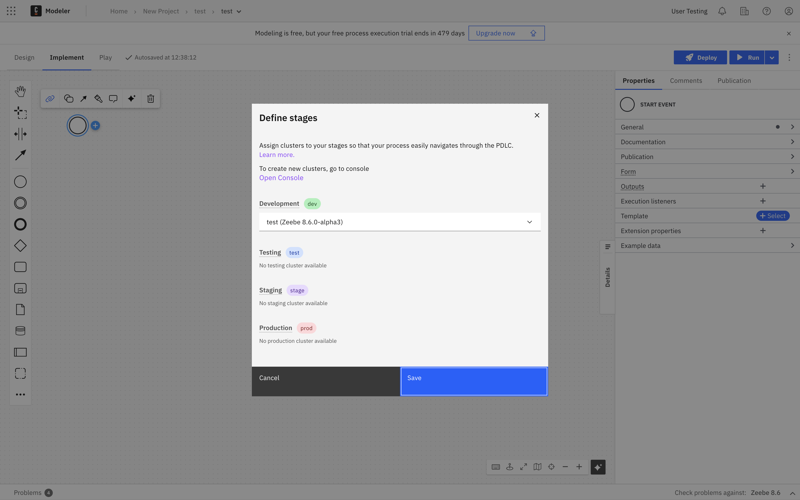

import EmptyProjectImg from './img/process-applications/empty-project.png'
import ReassignMainProcessImg from './img/process-applications/reassign-main-process.png'
import FileListImg from './img/process-applications/file-list.png'
import DeployProcessApplicationImg from './img/process-applications/deploy-process-application.png'
import RunProcessApplicationImg from './img/process-applications/run-process-application.png'
import DeployErrorImg from './img/process-applications/deploy-error.png'

You can deploy your process application to a Zeebe cluster, and run a new process instance.

## Deploy a process application

Open the process application's [main process](#main-process) and use the **Deploy** button to deploy the process application to a Zeebe cluster.

All BPMN, DMN, and form files contained in the process application folder will be deployed in a single bundle.

:::note
If any resource fails to deploy, the whole deployment will [fail](#deployment-errors) and the cluster state will remain unchanged.
This ensures that a process application cannot be deployed incompletely or in an inconsistent state, making it safer to use.
:::

Note that when you select **Deploy**, you may also select **Define stages** to set up a pipeline for development, and the promotion from one stage to another of a given process application version:

Here, you can select the applicable cluster for development, testing, staging, and production:

If no cluster is selected for at least one stage, a warning may appear reading **Undefined stages**. To deploy, you must define clusters for your stages.

## Run a process application

Open the process application's [main process](#main-process) and use the **Run** button to start a new instance.
Before the actual process instance is started, all resources will be re-deployed if required so the new instance
will always use their latest state.

After the process instance is started, you will receive a notification with a link to the process instance view in
[Operate](../../operate/operate-introduction.md).
Follow this link to monitor the process instance and interact with it as needed.

:::info
Single-file deployment is not supported in a process application.
If you click the **Deploy** or **Run** button for any diagram other than the main process, you will be asked to open the
main process instead to deploy the whole process application from there.
:::

## Deployment errors

If the deployment of a process application fails (for example, because one or more of the contained resources have invalid
implementation properties), a modal containing the error message thrown by the Zeebe engine will be displayed.
The message usually comprises the name of the affected resource, the ID of the invalid diagram element, and the actual error.

### Deployment of external resources

You can link BPMN processes, DMN decisions, or forms that are not part of the process application itself (external
resources) from any process inside a process application.

Note that when you deploy the process application:

- Linked external forms will be deployed together with the process application.
- Linked external BPMN and DMN diagrams are _not_ deployed together. They must be deployed separately.
