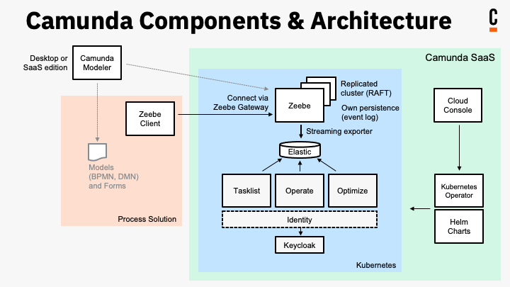

import DocCardList from '@theme/DocCardList';

[Camunda 8](https://camunda.io) delivers scalable, on-demand process automation as-a-service. Camunda 8 is combined with powerful execution engines for BPMN processes and DMN decisions, and paired with tools for collaborative modeling, operations, and analytics.

Camunda 8 consists of six [components](/components/components-overview.md). Together, these components form the complete Camunda 8 SaaS experience to manage, model, execute, and analyze business processes:

<DocCardList items={[{type:"link", href:"/docs/next/components/console/introduction-to-console/", label: "Console", docId:"components/console/introduction-to-console"},
{
type:"link", href:"/docs/next/components/modeler/about-modeler/", label: "Modeler", docId:"components/modeler/about-modeler",
},
{
type:"link", href:"/docs/next/components/zeebe/zeebe-overview/", label: "Zeebe", docId:"components/zeebe/zeebe-overview",
},
{
type:"link", href:"/docs/next/components/tasklist/introduction-to-tasklist/", label: "Tasklist", docId:"components/tasklist/introduction-to-tasklist",
},
{
type:"link", href:"/docs/next/components/operate/operate-introduction/", label: "Operate", docId:"components/operate/operate-introduction",
},
{
type:"link", href:"/optimize/next/components/what-is-optimize/", label: "Optimize", description: "Improve your processes by leveraging process data and analyzing areas for improvement."
}
]}/>

In the architecture diagram below, take a closer look at how these components work together. Don't worry if you're not sure about all the terminology yet, as this is merely a visual overview of how the components work together. Step through the [getting started section](#getting-started) below for step-by-step guidance through Camunda, or find additional details in [What is Camunda 8](components/concepts/what-is-camunda-8.md), and an on-demand demonstration of the product in [Camunda Academy](https://bit.ly/3CvooTX).

Additionally, Camunda hosts a section of [Best Practices](/components/best-practices/best-practices-overview.md). A mix of conceptual and practical implementation information, this section hosts our condensed experience using BPMN and DMN on the Camunda tool stack collected by consulting engagement with our customers and feedback from the community.

:::note Looking for deployment guides?

Deployment guides for Camunda 8 components are available in the [Self-Managed section]/self-managed/about-self-managed.md.

:::

:::note Interested in migrating from Camunda 7 to Camunda 8?
Interested in migrating process solutions developed for Camunda 7 to run them on Camunda 8? Visit our guide on [migrating from Camunda 7](/guides/migrating-from-camunda-7/index.md).
:::

## Getting started

In this section of the Camunda 8 documentation, you'll find guides to get started with Camunda 8 before learning more about each individual [component](/components/components-overview.md). Our getting started guides walk you through the following steps:

<DocCardList items={[{type:"link", href:"/docs/next/guides/create-account/", label: "Step 1: Create a Camunda 8 account", docId:"guides/create-account"},
{
type:"link", href:"/docs/next/guides/model-your-first-process/", label: "Step 2: Model your first process", docId:"guides/model-your-first-process",
},
{
type:"link", href:"/docs/next/guides/create-cluster/", label: "Step 3: Create a cluster", docId:"guides/create-cluster",
},
{
type:"link", href:"/docs/next/guides/getting-started-orchestrate-human-tasks/", label: "Step 4: Orchestrate human tasks", docId:"guides/orchestrate-human-tasks",
},
{
type:"link", href:"/docs/next/guides/getting-started-orchestrate-apis/", label: "Step 5: Orchestrate APIs", docId:"guides/orchestrate-apis",
},
{
type:"link", href:"/docs/next/guides/getting-started-orchestrate-microservices/", label: "Step 6: Orchestrate microservices", docId:"guides/orchestrate-microservices",
}
]}/>

## Learn more

After getting started with Camunda 8, dive deeper in our next steps section of the guides by learning about the following:

<DocCardList items={[{type:"link", href:"/docs/next/guides/setting-up-development-project/", label: "Set up your first development project", docId:"guides/setting-up-development-project"},
{
type:"link", href:"/docs/next/guides/setup-client-connection-credentials/", label: "Set up client connection credentials", docId:"guides/setup-client-connection-credentials",
},
{
type:"link", href:"/docs/next/guides/automating-a-process-using-bpmn/", label: "Automate a process using BPMN", docId:"guides/automating-a-process-using-bpmn",
},
{
type:"link", href:"/docs/next/guides/configuring-out-of-the-box-connector/", label: "Configure a Connector", docId:"guides/configuring-out-of-the-box-connectors",
},
{
type:"link", href:"/docs/next/guides/create-decision-tables-using-dmn/", label: "Create decision tables with DMN", docId:"guides/create-decision-tables-using-dmn",
},
{
type:"link", href:"/docs/next/guides/utilizing-forms/", label: "Build forms with Modeler", docId:"guides/utilizing-forms",
},
{
type:"link", href:"/docs/next/guides/improve-processes-with-optimize/", label: "Improve processes with Optimize", docId:"guides/improve-processes-with-optimize",
},
{
type:"link", href:"/docs/next/guides/message-correlation/", label: "Learn about message correlation", docId:"guides/message-correlation",
}
]}/>
